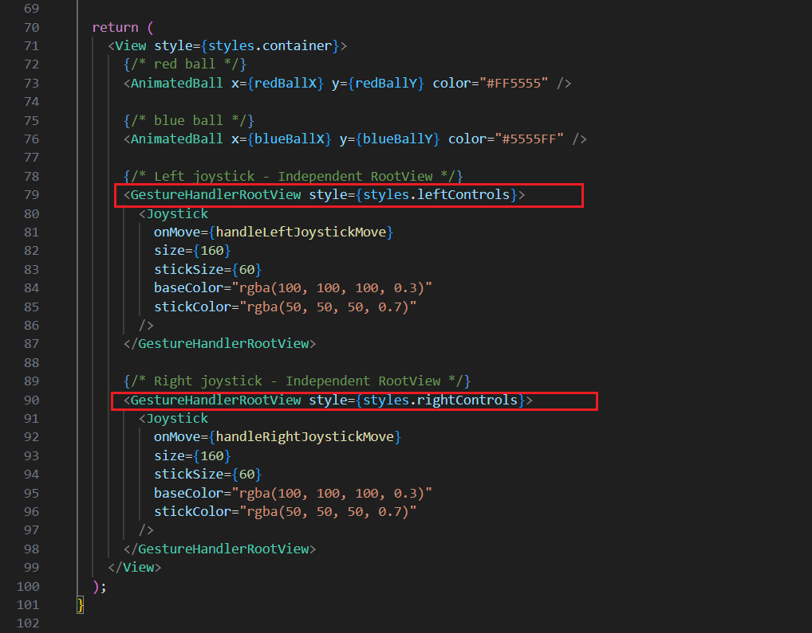

# React Native 游戏双摇杆演示
# React Native Game Dual Joystick Demo

本项目是在 **[RN-Game-Joystick](https://github.com/adamthewebguy/RN-Game-Joystick)** 项目基础上进行简单的修改，

原项目是一个摇杆控制一个小球，我在此基础上实现两个摇杆控制两个小球，摇杆之间互不影响，可以同时操控，

可用于双摇杆控制的场景，如游戏、无人机和赛车遥控，下面是运行效果：

<div align="center">
    
</div>

### 双摇杆是如何实现的
默认情况下，React Native Gesture Handler（RNGH）在同一个 GestureHandlerRootView 内只允许一个手势处于活跃状态（active），即使它们区域不重叠。

要支持多个同时激活的手势（如双摇杆、多指绘画），每个独立的手势组件应包裹在自己的 GestureHandlerRootView 中。

实现双摇杆的关键就是每个 Joystick 必须使用独立的 **GestureHandlerRootView** (**查看 app\index.tsx**)。

<div align="center">
    
</div>


下面的文档内容基本上是原项目文档的翻译内容，只是在一些描述上做了修改，详情参考原项目--> **[RN-Game-Joystick](https://github.com/adamthewebguy/RN-Game-Joystick)** 

一款极简、性能高的React Native游戏双摇杆控制器实现，采用Expo、React Native Reanimated v4和Gesture Handler构建。

## 特点

- 🎮虚拟双摇杆，手势作流畅
- ⚡ 基于帧的动画在UI线程上实现60fps性能
- 🎯 边界约束字符移动
- 📱 适用于iOS、Android和网页版
- 🔧 支持TypeScript及完整类型定义
- 📚 全面的组件文档

## 项目

该项目展示了:
- 两个可拖曳的摇杆控制器，可以报告方向输入
- 两个角色（红、蓝色小球），根据摇杆位置持续移动
- UI 线程上的动画流畅运行
- 正确的边界检测以保持角色在屏幕上

## 快速使用

### 环境依赖

- Node.js 18+ 
- npm 或者 yarn
- Expo CLI (可选，包含在依赖中)

### 安装

```bash
# 克隆此项目
cd React-Native-Game-Dual-Joysticks

# 安装依赖
npm install

# 启动
npx expo start
```

然后：

  按下 **i** 键启动 iOS 模拟器
  
  按下 **a** 键启动 Android 模拟器
  
  用 **Expo Go** 应用扫描二维码

## 项目结构

```
RN-Game-Joystick/
├── app/
│   ├── _layout.tsx          # 根布局（最小）
│   └── index.tsx            # 主游戏画面与操纵杆演示
├── components/
│   └── game/
│       ├── Joystick.tsx     # 虚拟摇杆组件
│       ├── Character.tsx    # 可移动小球组件
│       └── README.md        # 组件文档
├── assets/
│   └── images/              # App 图标
│   └── display.gif          # APP 演示效果
│   └── double_joysticks.png # 双摇杆实现代码  
├── .gitignore               # Git ignore file
├── app.json                 # Expo 配置
├── package.json             # 项目依赖
├── tsconfig.json            # TypeScript 配置
└── README.md                # 中文文档
└── README_en.md             # 英文文档
|__SETUP.md                  # 设置说明
```

## 用法

### 基本实现

```typescript
import { useCallback } from "react";
import { useSharedValue, useFrameCallback } from "react-native-reanimated";
import { Joystick, Character } from "@/components/game";

export default function GameScreen() {
  // 小球位置
  const characterX = useSharedValue(100);
  const characterY = useSharedValue(100);

  // 摇杆输入
  const joystickX = useSharedValue(0);
  const joystickY = useSharedValue(0);

  // 更新每一帧
  useFrameCallback(() => {
    characterX.value += joystickX.value * 5;
    characterY.value += joystickY.value * 5;
  });

  const handleJoystickMove = useCallback((x: number, y: number) => {
    joystickX.value = x;
    joystickY.value = y;
  }, []);

  return (
    <>
      <Character x={characterX} y={characterY} />
      <Joystick onMove={handleJoystickMove} />
    </>
  );
}
```

### 定制化

**调整小球移动速度:**

```typescript
const moveSpeed = 8;    // 小球的移动速度
useFrameCallback(() => {
  characterX.value += joystickX.value * moveSpeed;
});
```

**自定义摇杆外观:**

```typescript
<Joystick
  size={200}
  stickSize={80}
  baseColor="rgba(33, 150, 243, 0.2)"
  stickColor="rgba(33, 150, 243, 0.8)"
/>
```

**改变小球参数:**

```typescript
<Character x={x} y={y} size={80} color="#4CAF50" />
```

## 包含内容

### 核心组成部分

- `Joystick.tsx` - 带有手势处理的虚拟摇杆
- `Character.tsx` - 可移动小球
- 完整的TypeScript支持
- 详细文档（you're reading it）

### 依赖关系

- Expo ~54.0.23
- React Native Reanimated ~4.1.1 (with scheduleOnRN)
- React Native Gesture Handler ~2.28.0
- React Native Worklets 0.5.1

## 工作原理

### 架构

**1.摇杆组件**：检测手势并报告归一化后的x/y值（-1到1）

**2.共享值**：存储摇杆输入和角色位置

**3.帧回调**：在UI线程上每秒更新字符位置60次

**4.角色组件**：在当前位置使用 Reanimated 进行渲染

### 线程模型
- 手势检测：UI线程（平滑、即时响应）
- 回调桥接：使用 `scheduleOnRN` 与 JS 线程通信
- 位置更新：UI 线程通过 `useFrameCallback`（60fps 性能）

这种混合方法在保持代码简洁且易于维护的同时，提供了卓越的性能。

## 关键依赖

- **expo**: ~54.0.23 - React Native 框架
- **react-native-reanimated**: ~4.1.1 - 60fps animations on UI thread
- **react-native-gesture-handler**: ~2.28.0 - Gesture detection
- **react-native-worklets**: 0.5.1 - Thread communication (scheduleOnRN)
- **expo-router**: ~6.0.14 - File-based routing

## 文档

有关详细的组件文档、实现细节及高级使用，请参见：

- [Component Documentation](./components/game/README.md) - 性能分析的深入指南

## 性能

- ✅ 设备上流畅实现60fps
- ✅ 针对双角色优化（本次演示）
- ✅ 可以无性能地处理1到10个字符
- ⚠️ 对于100+实体，可以考虑纯UI线程优化（参见组件README）

## 故障排除技巧

### 1 Console.log 在 worklets 中崩溃

**问题**: 在 `useFrameCallback` 中使用 `console.log` 会导致崩溃。

**解决方案**：使用：`scheduleOnRN`

```typescript
import { scheduleOnRN } from "react-native-worklets";

useFrameCallback(() => {
  scheduleOnRN(console.log, "Position:", x.value);
});
```

### 2 角色不会持续移动

**问题**：当摇杆保持稳定时，角色会停止。

**解决方案**：使用 `useFrameCallback` 在每一帧轮询摇杆数值（此演示中已实现）

### 3 手势不起作用

**问题**：摇杆对触碰没有响应。

**解决方案**：确保你的应用被包裹在 GestureHandlerRootView 中（已在 `app/index.tsx`中完成）。

## 扩展演示
下面是一些可以拓展的方向：
- 添加多个小球
- 实现碰撞检测
- 添加敌人或障碍物
- 用额外的按键实现射击/动作
- 添加加速度/动量物理
- 创建一个有边界的游戏场地
- 添加分数追踪

## 更多
- [RN-Game-Joystick](https://github.com/adamthewebguy/RN-Game-Joystick)
- [React Native Reanimated Docs](https://docs.swmansion.com/react-native-reanimated/)
- [React Native Worklets Docs](https://docs.swmansion.com/react-native-worklets/)
- [React Native Gesture Handler Docs](https://docs.swmansion.com/react-native-gesture-handler/)
- [Expo Documentation](https://docs.expo.dev/)

## Licence

MIT

---

注意：这是一个简约演示，专注于纵杆控制器的功能。它有意排除主题系统、导航复杂性及其他模板，以保持实现清晰易懂。 它最初是基于开箱即用的 Expo 应用模板（using `npx create-expo-app@latest` with Expo SDK 54），然后进行了简化以消除不必要的复杂性。我对这个项目不做任何保证。
